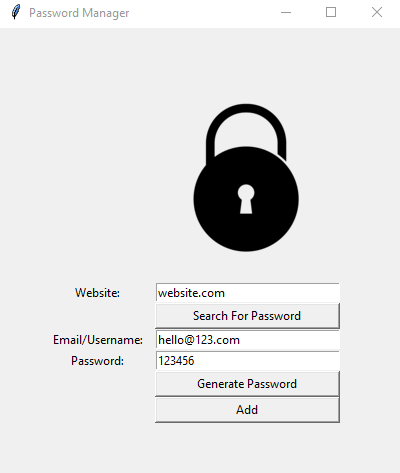

# Password Manager 🔑

## Welcome to my password manager repo

### In order to use this program first download the zip or git clone this project.

> Note: This project is made using only python with it's in-built 'tkinter' module.

 

*If you are anything like me and don't trust saving your password on the cloud then you may like this program. Using this program you can store your passwords on local computer.*

 

> Note: You can also generate random strong passwords by clicking the 'Generate Password' button.

> Important: This local password manager may not work in operating systems other than Windows.

 

## Thank you for checking out this project.

 

## Stay safe high five ✋.